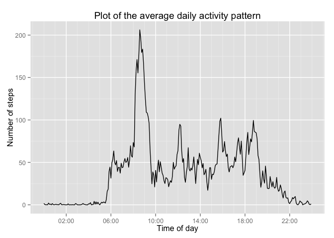

# Reproducible Research: Peer Assessment 1

Before begininng the data analysis, we will load packages that will be useful 
in our analysis. 


```r
library(dplyr)
```

```
## 
## Attaching package: 'dplyr'
## 
## The following object is masked from 'package:stats':
## 
##     filter
## 
## The following objects are masked from 'package:base':
## 
##     intersect, setdiff, setequal, union
```

```r
library(lubridate)
library(ggplot2)
library(scales)
```

## Loading and preprocessing the data

The data for this assessment is contained in a zip file.  We can load the
data directly from the zip file using the function <code>unz()</code> inside 
our call to <code>read.csv()</code>.  We can create a data frame table with
the <code>tbl_df()</code> that makes printing simpler.


```r
activity <- read.csv(unz("activity.zip", "activity.csv"),
                     header=TRUE, stringsAsFactors=FALSE)
activity <- tbl_df(activity)
```

Let's look at the data and check the class of each column to see what we have.


```r
activity
```

```
## Source: local data frame [17,568 x 3]
## 
##    steps       date interval
## 1     NA 2012-10-01        0
## 2     NA 2012-10-01        5
## 3     NA 2012-10-01       10
## 4     NA 2012-10-01       15
## 5     NA 2012-10-01       20
## 6     NA 2012-10-01       25
## 7     NA 2012-10-01       30
## 8     NA 2012-10-01       35
## 9     NA 2012-10-01       40
## 10    NA 2012-10-01       45
## ..   ...        ...      ...
```

```r
lapply(activity,class)
```

```
## $steps
## [1] "integer"
## 
## $date
## [1] "character"
## 
## $interval
## [1] "integer"
```

We have three columns in our data set: 

- an integer number of steps measured in a 5 minute interval
- a character string for the date that the measurement was taken
in the format *yyyy-mm-dd*
- an integer representing the time in a format *hhmm*

For the moment we will leave the date variable as it is but we 
would ideally like the time interval to be of the form *hh:mm*.
To do this, we need several steps. We first pad the current value with 
leading zeros using <code>formatC()</code> and then convert this to a
date time variable with <code>strptime()</code>. <code>strptime()</code>
will append today's date so the last step is to use <code>format()</code> 
to keep only the time as a string of the form *hh:mm*.


```r
activity$interval <-  activity$interval %>% 
                      formatC(width=4,format="d",flag="0") %>%
                      strptime(format="%H%M") %>% 
                      format(format="%H:%M")
activity
```

```
## Source: local data frame [17,568 x 3]
## 
##    steps       date interval
## 1     NA 2012-10-01    00:00
## 2     NA 2012-10-01    00:05
## 3     NA 2012-10-01    00:10
## 4     NA 2012-10-01    00:15
## 5     NA 2012-10-01    00:20
## 6     NA 2012-10-01    00:25
## 7     NA 2012-10-01    00:30
## 8     NA 2012-10-01    00:35
## 9     NA 2012-10-01    00:40
## 10    NA 2012-10-01    00:45
## ..   ...        ...      ...
```

## What is mean total number of steps taken per day?

The first item we would like to look at is the total number of steps
taken per day.  For that we simply group our data by date and then
sum the number of steps.


```r
by_day <- summarise(group_by(activity, date),total_steps=sum(steps))
by_day
```

```
## Source: local data frame [61 x 2]
## 
##          date total_steps
## 1  2012-10-01          NA
## 2  2012-10-02         126
## 3  2012-10-03       11352
## 4  2012-10-04       12116
## 5  2012-10-05       13294
## 6  2012-10-06       15420
## 7  2012-10-07       11015
## 8  2012-10-08          NA
## 9  2012-10-09       12811
## 10 2012-10-10        9900
## ..        ...         ...
```

Note that in taking the sum above, we did not say to remove NA values.  
The reason for this is that in the dataset there are entire days with
no data points and if we say to ignore NA values, the sum of the steps
for that day would be be zero. A zero could be interpreted as saying 
that the person stayed in one position and did not take a single 
step for an entire day.  That is quite different from an NA value which
says "we don't know, we don't have any data".

Let's plot a histogram of the total number of steps per day.  


```r
hist (by_day$total_steps, 
      main="Histogram of the total number of steps per day",
      xlab="Total steps per day",
      ylab="Frequency (days)",
      col="green")
```

 

From the above histogram we can say that on average this person took
between 10000 and 15000 steps per day. We can find out exactly what 
that is by finding the mean and the median of the total steps per day.


```r
mean(by_day$total_steps, na.rm=TRUE)
```

```
## [1] 10766.19
```

```r
median(by_day$total_steps, na.rm=TRUE)
```

```
## [1] 10765
```

## What is the average daily activity pattern?

To see what the daily activity pattern looks like, we need to
group the data by time interval and average the number of steps.
We can then convert the interval string to a POSIXct time using 
<code>strptime()</code> and <code>format()</code>


```r
by_interval <- summarise(group_by(activity, interval),
                         average_steps = mean(steps, na.rm=TRUE))
by_interval
```

```
## Source: local data frame [288 x 2]
## 
##    interval average_steps
## 1     00:00     1.7169811
## 2     00:05     0.3396226
## 3     00:10     0.1320755
## 4     00:15     0.1509434
## 5     00:20     0.0754717
## 6     00:25     2.0943396
## 7     00:30     0.5283019
## 8     00:35     0.8679245
## 9     00:40     0.0000000
## 10    00:45     1.4716981
## ..      ...           ...
```

To plot this and see the pattern, we need to convert the interval
string to a POSIXct time.


```r
g <- ggplot(by_interval, 
            aes(as.POSIXct(interval, format="%H:%M"), average_steps))

g + geom_line() +
    scale_x_datetime(breaks = date_breaks("4 hour"),
                     minor_breaks = date_breaks("1 hour"),
                     labels=date_format("%H:%M")) +
    labs(title = "Plot of the average daily activity pattern") +
    labs(x = "Time of day") +
    labs(y = "Number of steps")
```

 

We can see in the plot that there is a big peak in activity in the morning,
probably as the person is on their way to work or school.  To find when that
peak occurs, we simply need to filter on the maximum value of *average_steps*.


```r
by_interval %>% filter(average_steps == max(average_steps))
```

```
## Source: local data frame [1 x 2]
## 
##   interval average_steps
## 1    08:35      206.1698
```

The peak of activity occurs at 8:35 am where there are approximately 207 steps
in that 5 minute interval.


## Imputing missing values

As mentioned previously, there are a number of NA values in the data set.
To see exactly how many, we can make an logical vector by passing our number
of steps to the <code>is.na()</code> function and then summing over the
vector.


```r
sum(is.na(activity$steps))
```

```
## [1] 2304
```

If we want to see on what days these occur, we can filter our *by_day*
subset according to which days have a *total.steps* value of NA.


```r
by_day %>% filter(is.na(total_steps))
```

```
## Source: local data frame [8 x 2]
## 
##         date total_steps
## 1 2012-10-01          NA
## 2 2012-10-08          NA
## 3 2012-11-01          NA
## 4 2012-11-04          NA
## 5 2012-11-09          NA
## 6 2012-11-10          NA
## 7 2012-11-14          NA
## 8 2012-11-30          NA
```

We see that there are 8 days where no data is available.  To impute 
values for these missing measurements, we can group by the interval
and then mutate steps using an *ifelse* statement.


```r
activity <- activity %>% 
            group_by(interval) %>% 
            mutate(steps=ifelse(is.na(steps), mean(steps, na.rm=TRUE), steps))
activity
```

```
## Source: local data frame [17,568 x 3]
## Groups: interval
## 
##        steps       date interval
## 1  1.7169811 2012-10-01    00:00
## 2  0.3396226 2012-10-01    00:05
## 3  0.1320755 2012-10-01    00:10
## 4  0.1509434 2012-10-01    00:15
## 5  0.0754717 2012-10-01    00:20
## 6  2.0943396 2012-10-01    00:25
## 7  0.5283019 2012-10-01    00:30
## 8  0.8679245 2012-10-01    00:35
## 9  0.0000000 2012-10-01    00:40
## 10 1.4716981 2012-10-01    00:45
## ..       ...        ...      ...
```

If we look at the first few lines of *activity* we can see that the values of
steps that were NA now correspond to the values of average_steps computed in
the last section.

## Are there differences in activity patterns between weekdays and weekends?

We want to know if there are differences in activity during the weekday 
compared to the weekend.  For that, we will add an extra field that takes
on the values of *weekday* and *weekend*. 

To determine determine if a date corresponds to a *weekday* or *weekend*, 
we will use the <code>wday()</code> function from lubridate.  The 
<code>wday()</code> function numbers the days from 1 to 7 with 1 being
Sunday and 7 being Saturday. Therefore, the days numbered 2 through 6 will
be classified as weekdays while days 1 and 7 are the weekend.


```r
activity$weekday_weekend <- ifelse((wday(activity$date) > 1) &
                                   (wday(activity$date) < 7), 
                                   "weekday", "weekend")
activity
```

```
## Source: local data frame [17,568 x 4]
## Groups: interval
## 
##        steps       date interval weekday_weekend
## 1  1.7169811 2012-10-01    00:00         weekday
## 2  0.3396226 2012-10-01    00:05         weekday
## 3  0.1320755 2012-10-01    00:10         weekday
## 4  0.1509434 2012-10-01    00:15         weekday
## 5  0.0754717 2012-10-01    00:20         weekday
## 6  2.0943396 2012-10-01    00:25         weekday
## 7  0.5283019 2012-10-01    00:30         weekday
## 8  0.8679245 2012-10-01    00:35         weekday
## 9  0.0000000 2012-10-01    00:40         weekday
## 10 1.4716981 2012-10-01    00:45         weekday
## ..       ...        ...      ...             ...
```

To see the difference in activity between weekdays and weekends, we want 
to take an average of the number of steps in an interval but this time 
with the added constraint of grouping by weekday and weekend.


```r
by_day_type <- summarise(group_by(activity, weekday_weekend, interval),
                                  average_steps = mean(steps, na.rm=TRUE))
by_day_type
```

```
## Source: local data frame [576 x 3]
## Groups: weekday_weekend
## 
##    weekday_weekend interval average_steps
## 1          weekday    00:00    2.25115304
## 2          weekday    00:05    0.44528302
## 3          weekday    00:10    0.17316562
## 4          weekday    00:15    0.19790356
## 5          weekday    00:20    0.09895178
## 6          weekday    00:25    1.59035639
## 7          weekday    00:30    0.69266247
## 8          weekday    00:35    1.13794549
## 9          weekday    00:40    0.00000000
## 10         weekday    00:45    1.79622642
## ..             ...      ...           ...
```

We can now create a plot of the average daily activity and specify our
*weekday_weekend* variable as the facet for creating separate plots for
*weekday* and *weekend*.


```r
g <- ggplot(by_day_type, 
            aes(as.POSIXct(interval, format="%H:%M"), average_steps))

g + geom_line() +
    facet_grid(weekday_weekend ~ .) + 
    scale_x_datetime(breaks = date_breaks("4 hour"),
                     minor_breaks = date_breaks("1 hour"),
                     labels=date_format("%H:%M")) +
    labs(title = "Comparison of activity between weekdays and weekends") +
    labs(x = "Time of day") +
    labs(y = "Number of steps")    
```

 
